# 🌀 blue-sbc

🌀 `@sbc` is an [`abcli`](https://github.com/kamangir/awesome-bash-cli) plugin for edge computing on [single board computers](https://github.com/kamangir/blue-bracket). 

```bash
pip install blue_sbc
```

|   |   |   |   |
| --- | --- | --- | --- |

```mermaid
graph LR

    lepton_capture["@sbc<br>lepton<br>capture"]
    lepton_preview["@sbc<br>lepton<br>preview"]

    object["📂 object"]:::folder
    camera["👁️‍🗨️ camera"]:::folder
    UI["💻 UI"]:::folder

    camera --> lepton_capture
    lepton_capture --> object

    camera --> lepton_preview
    lepton_preview --> UI

    classDef folder fill:#999,stroke:#333,stroke-width:2px;
```

| [](https://github.com/kamangir/blue-bracket/blob/main/designs/blue3.md) | [](https://github.com/kamangir/blue-bracket/blob/main/designs/chenar-grove.md) | [](https://github.com/kamangir/blue-bracket/blob/main/designs/cube.md) | [](https://github.com/kamangir/blue-bracket/blob/main/designs/eye_nano.md) |



---


[](https://github.com/kamangir/blue-sbc/actions/workflows/pylint.yml) [](https://github.com/kamangir/blue-sbc/actions/workflows/pytest.yml) [](https://github.com/kamangir/blue-sbc/actions/workflows/bashtest.yml) [](https://pypi.org/project/blue-sbc/) [](https://pypistats.org/packages/blue-sbc)

built by 🌀 [`blue_options-4.210.1`](https://github.com/kamangir/awesome-bash-cli), based on 🌀 [`blue_sbc-7.20.1`](https://github.com/kamangir/blue-sbc).
