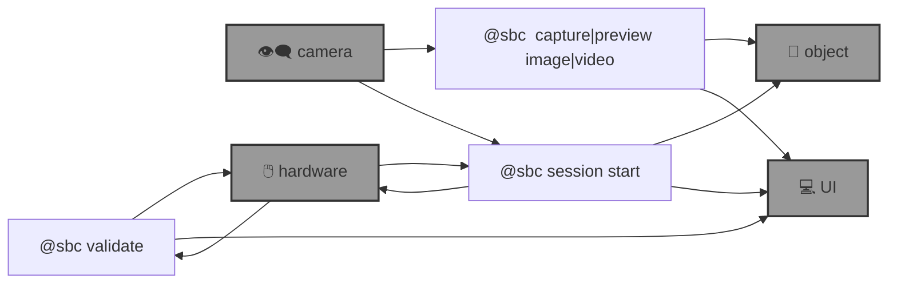

# 🌀 blue-sbc

🌀 `@sbc` is an [`abcli`](https://github.com/kamangir/awesome-bash-cli) plugin for edge computing on [single board computers](https://github.com/kamangir/blue-bracket). 

```bash
pip install blue_sbc

# @env dot list
@env dot cp <env-name> local
```

--table--



# branches

- [current](.) active and default branch.
- [main](https://github.com/kamangir/blue-sbc/tree/main) legacy branch, is running on [a cluster of Raspberry pis](https://github.com/kamangir/blue-bracket). ⚠️ do not touch. ⚠️

---

--signature--

