# 🌀 blue-sbc

🌀 `@sbc` is an [`abcli`](https://github.com/kamangir/awesome-bash-cli) plugin for edge computing on [single board computers](https://github.com/kamangir/blue-bracket). 

```bash
pip install blue_sbc
```

--table--

```mermaid
graph LR
    camera["@sbc <camera> capture|preview image|video"]

    hardware_validate["@sbc <hardware> validate <options>"]

    session_start["@sbc session start"]

    object["📂 object"]:::folder
    camera_hardware["👁️‍🗨️ camera"]:::folder
    hardware["🖱️ hardware"]:::folder
    UI["💻 UI"]:::folder

    camera_hardware --> camera
    camera --> object
    camera --> UI

    hardware --> hardware_validate
    hardware_validate --> hardware
    hardware_validate --> UI

    hardware --> session_start
    camera_hardware --> session_start
    session_start --> object

    classDef folder fill:#999,stroke:#333,stroke-width:2px;
```



---

--signature--